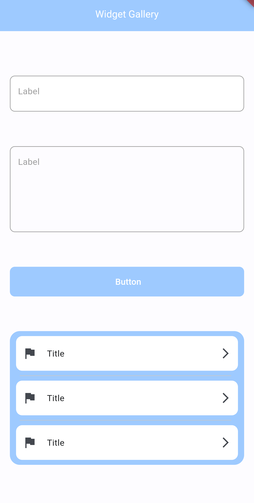

# widget_gallery

There is a simple Flutter widget gallery!

You can get this application with different widgets and customize them how do you want.
Currently, the gallery includes the following widgets: 
- BaseButton (More convenient than the standard ElevatedButton), 
- BaseTextField (You can quickly and easily switch to password entry mode), 
- BigTextField(A text input field whose height can be adjusted), 
- ActionPanel (Includes ActionPanelListTile).

You can see the examples below.

