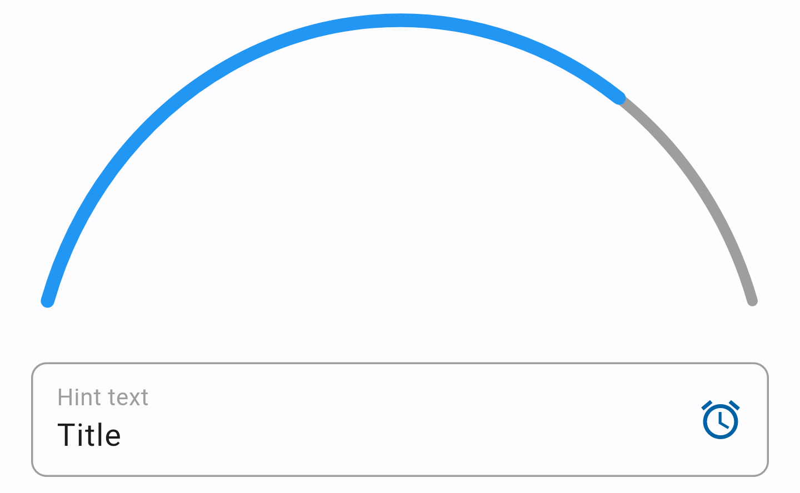

# widget_gallery

There is a simple Flutter widget gallery!

You can get this application with different widgets and customize them how do you want.
Currently, the gallery includes the following widgets: 
- BaseButton (More convenient than the standard ElevatedButton);
- BaseTexfield (You can quickly and easily switch to password entry mode); 
- BigTextfield (A text input field whose height can be adjusted); 
- ActionPanel (Includes ActionPanelListTile);
- ArcProgressBar (Progress bar in the form of an arc);
- ContainerWithButton (Simple bordered container with icon button);
- HotBottomSheet (A quick bottom sheet that gets a child of the Widget type);
- Expandable (The custom expandable widget like ExpansionTile but more simple) 
  (This widget is not in the screenshots because it is invisible and child is required).
- Carousel (Carousel slider widget without any packages);  

You can see the examples below.

  

There is the Carousel widget

And also, there are some helper methods:
- RelativeRect getClickPosition({required BuildContext context, required Offset globalPositionOffest}) - for getting  "globalPositionOffest" you gotta use the onTapDown in GestureDetector or InkWell;
- String convertImageFileToBase64(File image, [String imageType = 'png']) - for converting image (as File) to String base64;
- void addCharacterAfterTextInTextfield(String character, TextEditingController controller);
- bool checkIsEmailCorrect(String email) 

Extension methods:
- extension (String) capitalize() - for capitalizing the firts letter;
- extension (List) swap(int first, int second) - for replacing two elements in list.
